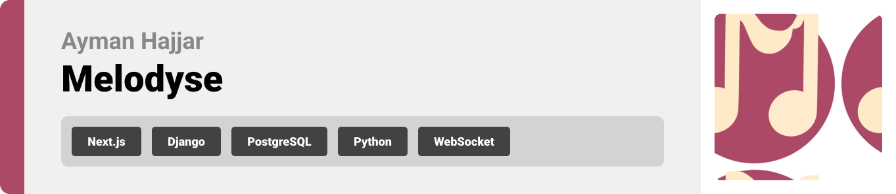

<br><br>

<!-- project philosophy -->
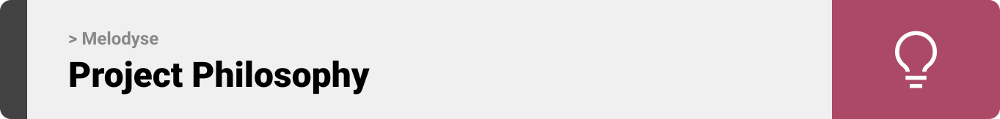

> Melodyse is a music collaboration website that matches musicians based on their musical interests and skills. Collaborate on projects, post your finihsed projects and get feedback, listen to new music, chat in real-time, and get AI assitance in your musical projects.
>
> Our mission is to bring musicians together and foster meaningful collaborations.

### User Stories
- As a user, i want to be able to signup and login, so that i can access my account and manage my projects.
- As a musician looking for collaboration opportunities, I want to be able to find musicians with similar insterests, so that I can find compatible collaborators.
- As a musician looking for help, I want to be able to hire musicians on a work-for-hire basis, so that I can receive help while retaining all rights to my work.
- As a beginner musician, I want to use the AI-assisted learning feature to improve my skills so that I can find better collaboration and work opportunities.
- As a songwriter, I want to use the AI-assisted songwriting feature to generate ideas inspired by my favorite artists, so that I can write better lyrics
- As a music producer, I want the AI assistant to help me with musical scales and notes, and mixing/mastering techniques so that I can produce better music.
- As a project manager, I want to be able to assign tasks to team members and organize them efficiently, so that we can complete work on time.
- As a musician working in a team, I want to be able to chat with my team, share files and make/receive payments, so that we can work together seamlessly and get paid for our work.
- As a musician, I want to be able to post my finished project on the platform and receive feedback, so that I can gain recognition and improve my skills.
- As a music fan, I want to be able to listen to music created on the website, so that I can discover new artists and enjoy a variety of music.
- As an admin, I want to be able to check the statistics of the website, manage users and update subscription plans, so that i can keep the website up and running.

<br><br>

<!-- Prototyping -->


> We designed Melodyse using wireframes and mockups, iterating on the design until we reached the ideal layout for easy navigation and a seamless user experience.

### Wireframes
| Profile screen  | Production Assistant screen |  Assistant screen |
| ---| ---| ---|
| 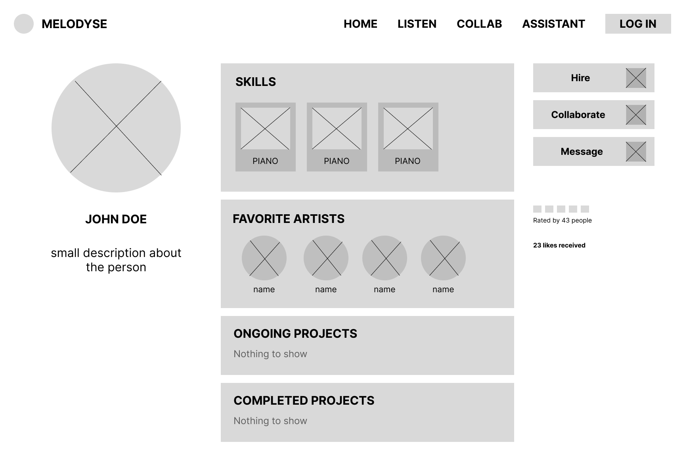 | 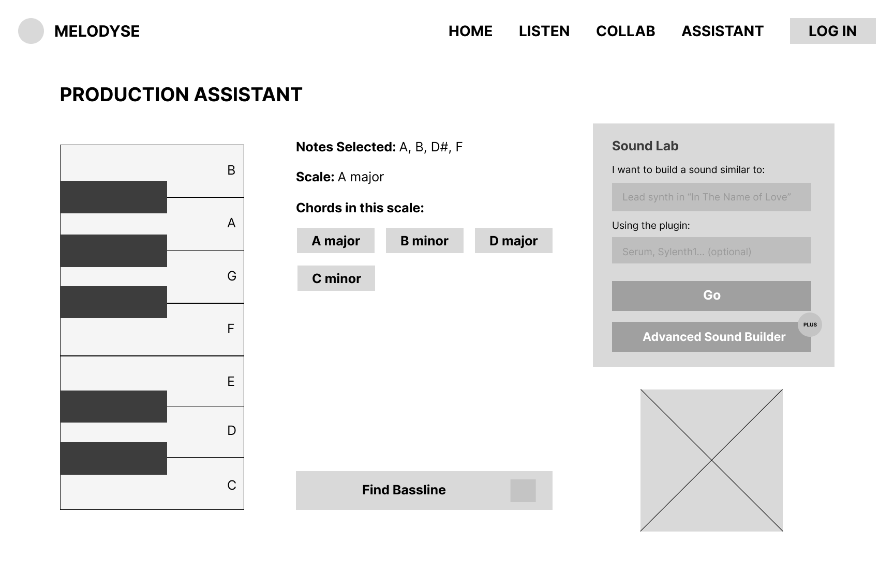 | 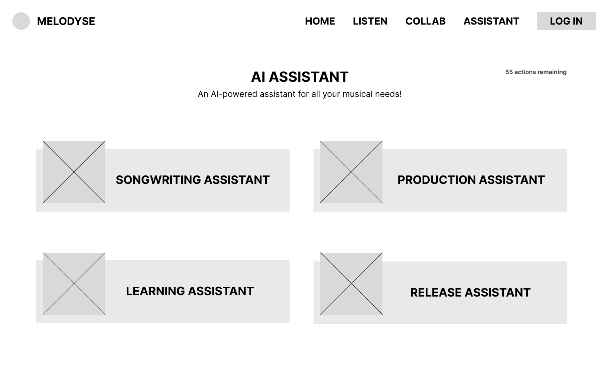 |

### Mockups
| Profile screen  | Songwriting Assistant Screen | Collab Screen |
| ---| ---| ---|
| 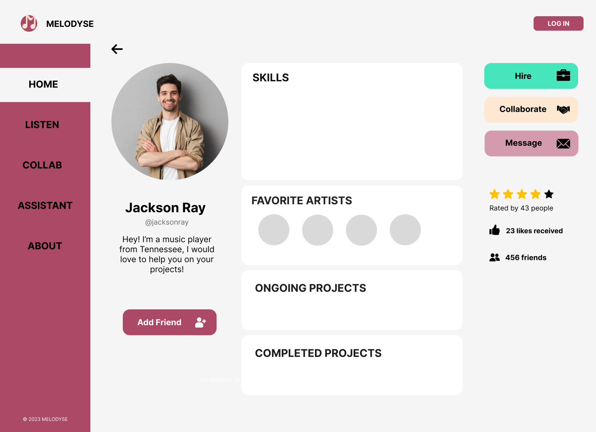 | 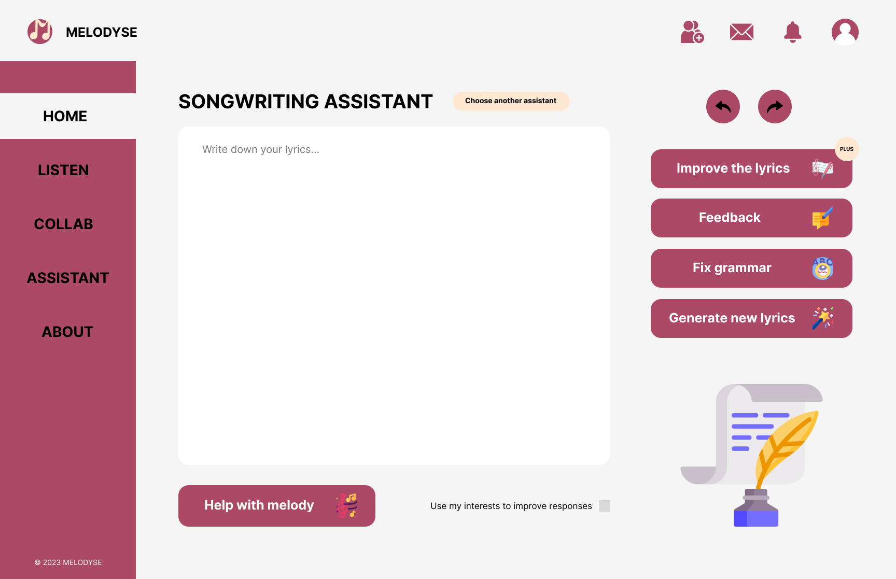 | 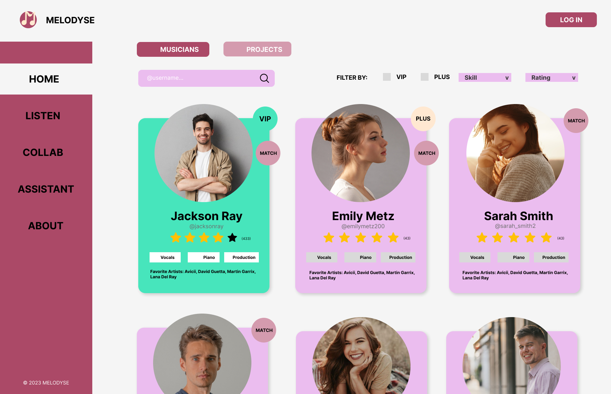 |

<br><br>

<!-- Implementation -->
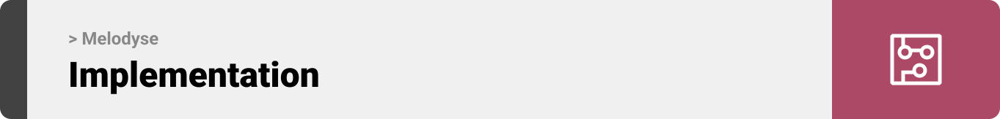

> Using the wireframes and mockups as a guide, we implemented Melodyse with the following features:

### User Screens
| Home screen #1  | Home screen #2 | Chat screen |
| ---| ---| ---|
| 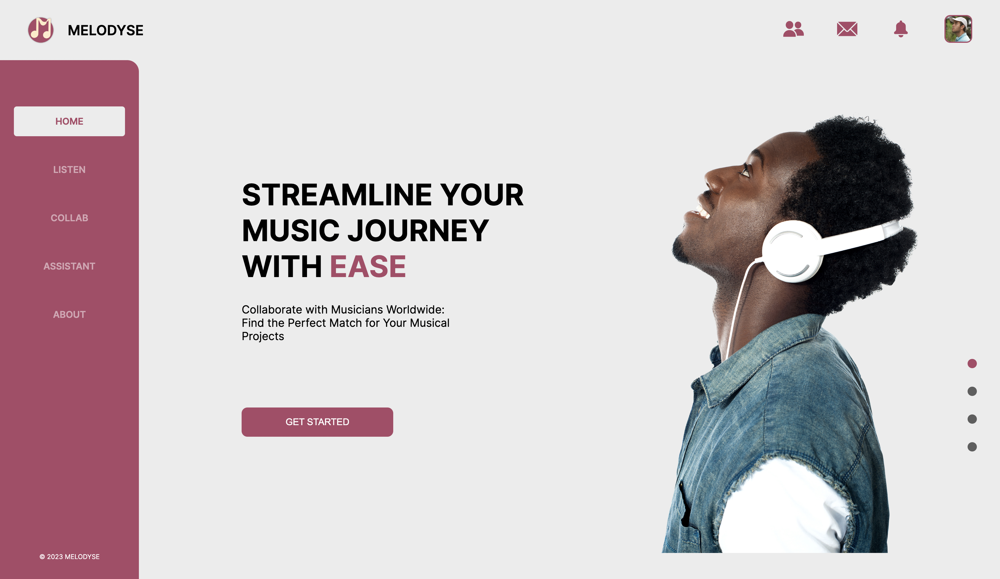 | 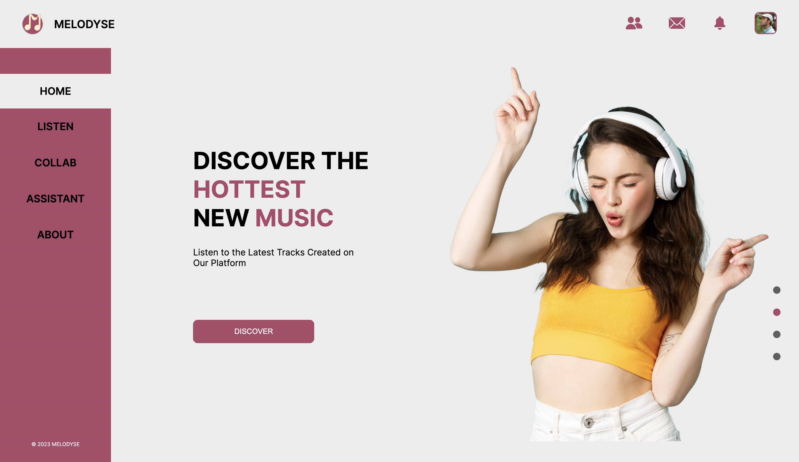 | 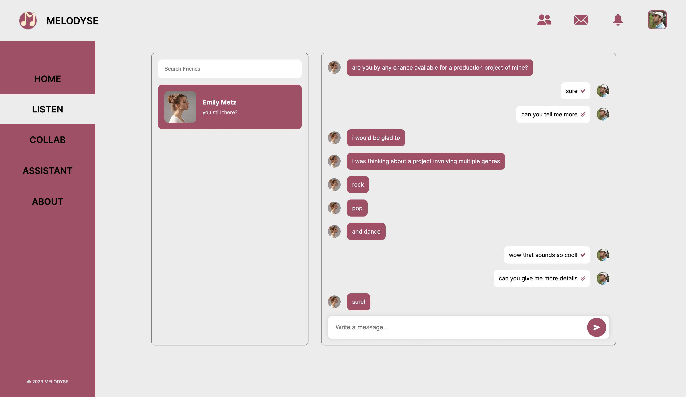 |

| Assistant screen | Collab screen  | Profile Screen |
| ---| ---| ---|
| 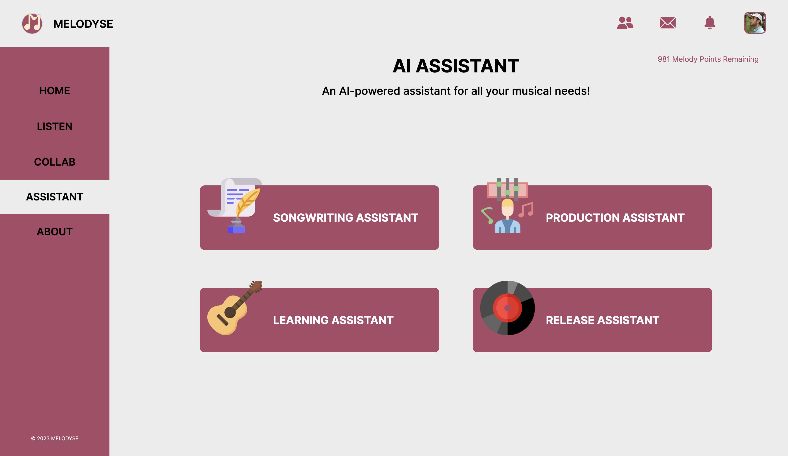 | 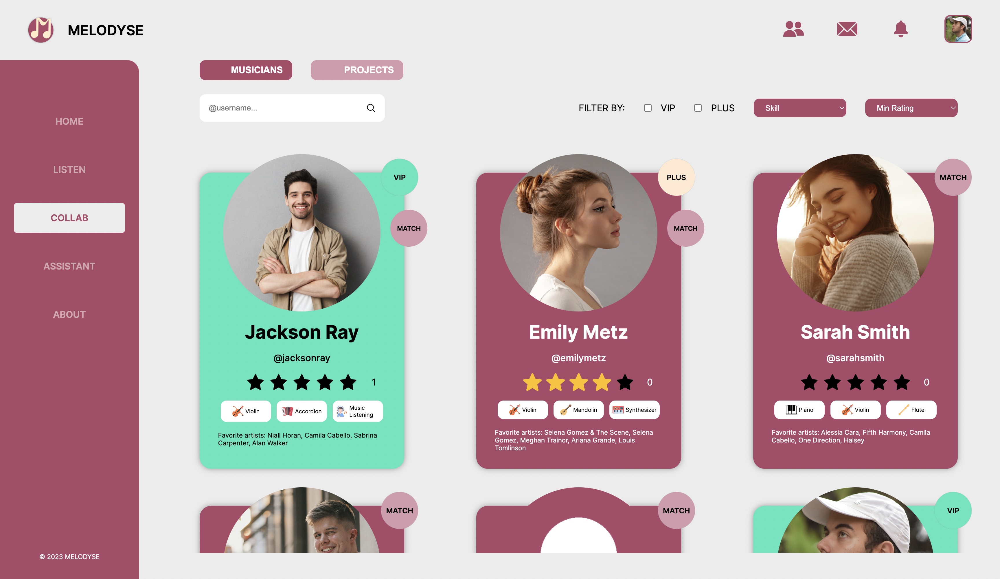 | 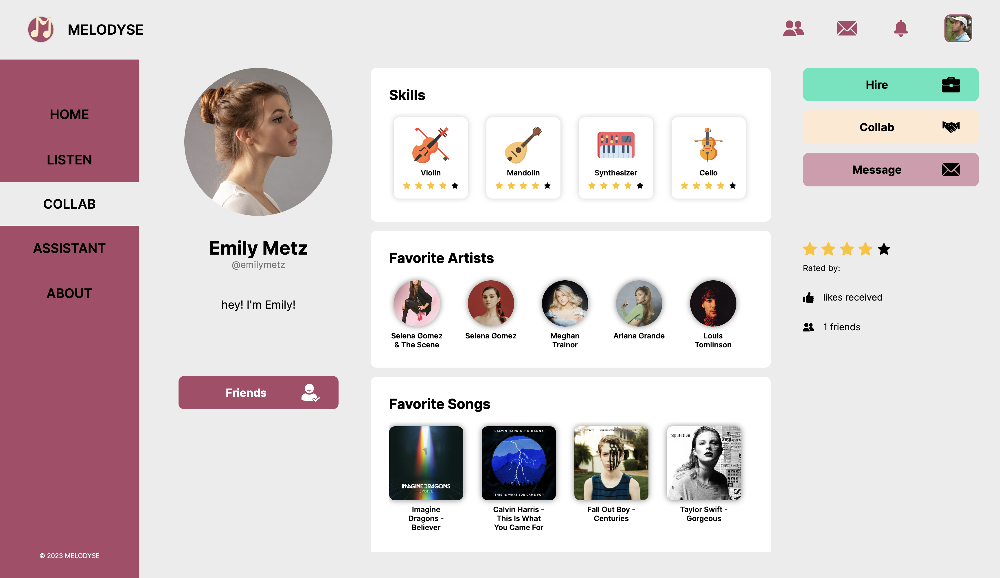 |

| Production Assistant Screen | Songwriting Assistant Screen | Learning Assistant screen  |
| ---| ---| ---|
|  | 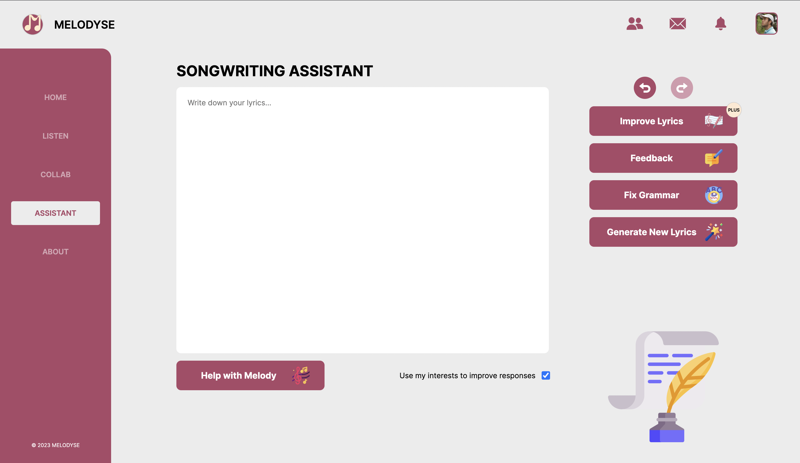 | 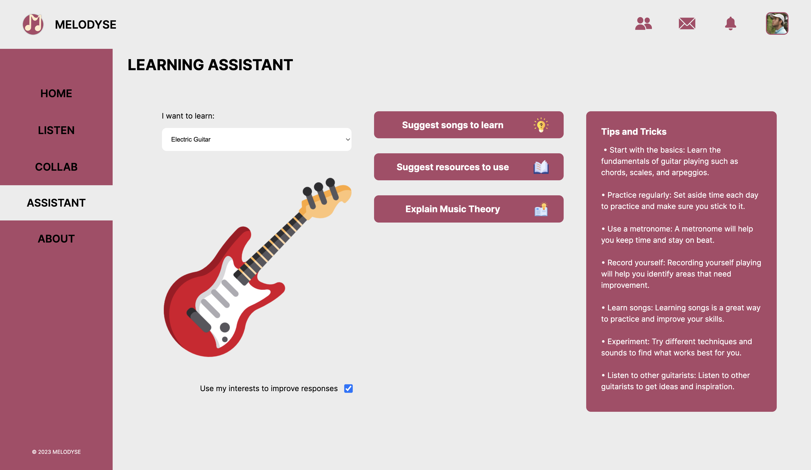 | 

| Release Assistant Screen | | |
| ---| ---| ---|
|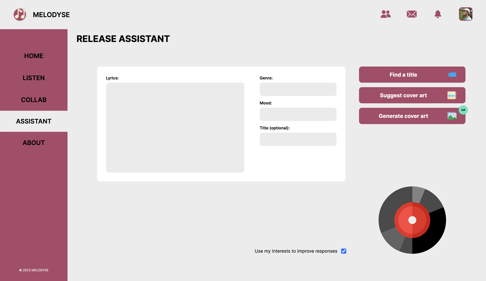 | | |

> To implement a matching algorithm, we used a small dataset that contains users and their favorite genres. We then used cosine similarity to calculate the similarities between the users. Here is what the dataset looks like :

### Dataset
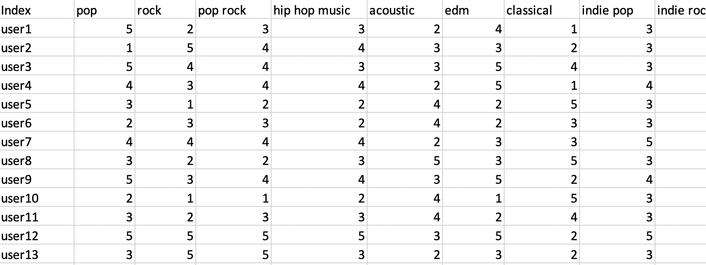


<br><br>

<!-- Tech stack -->
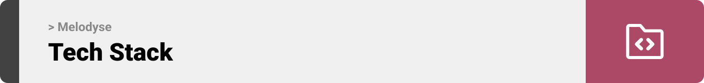

###  Melodyse is built using the following technologies:

- This project is built using the [Next.js front end framework](https://nextjs.org/). Used by some of the world's largest companies, Next.js enables you to create full-stack Web applications by extending the latest React features, and integrating powerful Rust-based JavaScript tooling for the fastest builds.
- For the back end, we used [Django](https://www.djangoproject.com/). Django is a robust python-based backend framework that makes it easier to build better web apps more quickly and with less code.
- For persistent storage (database), the app uses [PostgreSQL](https://www.postgresql.org/), which allows the app to create a custom storage schema and save it to a local database. Using PostgreSQL instead of other dmbs allows for storage of special data structures like arrays and json objects.
- To allow real-time chatting and real-time notifications, the app uses a combination of [Django Channels](https://channels.readthedocs.io/en/stable/) and [WebSocket](https://developer.mozilla.org/en-US/docs/Web/API/WebSockets_API). 
- The app uses the font ["Inter"](https://fonts.google.com/specimen/Inter) as its main font, and the design of the app adheres to the material design guidelines.

<br><br>

<!-- How to run -->


<!-- > To set up Coffee Express locally, follow these steps:

### Prerequisites

This is an example of how to list things you need to use the software and how to install them.
* npm
  ```sh
  npm install npm@latest -g
  ```

### Installation

_Below is an example of how you can instruct your audience on installing and setting up your app. This template doesn't rely on any external dependencies or services._

1. Get a free API Key at [https://example.com](https://example.com)
2. Clone the repo
   ```sh
   git clone https://github.com/your_username_/Project-Name.git
   ```
3. Install NPM packages
   ```sh
   npm install
   ```
4. Enter your API in `config.js`
   ```js
   const API_KEY = 'ENTER YOUR API';
   ```

Now, you should be able to run Coffee Express locally and explore its features. -->