<br><br>

<!-- project philosophy -->


> Melodyse is a music collaboration website that matches musicians based on their musical interests and skills. Collaborate on projects, post your finihsed projects and get feedback, listen to new music, chat in real-time, and get AI assitance in your musical projects.
>
> Our mission is to bring musicians together and foster meaningful collaborations.

### User Stories
- As a musician looking for collaboration opportunities, I want to be able to find musicians with similar insterests, so that I can find compatible collaborators.
- As a musician, i want the AI assistant to help me write better lyrics, improve my melodies and give me some tips, so that i can become a better musician.
- As a project manager, I want to be able to assign tasks to team members and organize them efficiently, so that we can complete work on time.
- As a musician, I want to be able to post my finished project on the platform and receive feedback, so that I can gain recognition and improve my skills.
- As a music fan, I want to be able to listen to music created on the website, so that I can discover new artists and enjoy a variety of music.

### Admin Stories
- As an admin, I want to be able to check the statistics of the website, so that i can identify my target audiance better.
- As an admin, I want to be able to end or delete projects, so that i can make sure everyone is satisfied and rules are not broken.

<br><br>

<!-- Prototyping -->


> We designed Melodyse using wireframes and mockups, iterating on the design until we reached the ideal layout for easy navigation and a seamless user experience.

### Wireframes
| Profile screen  | Production Assistant screen |  Assistant screen |
| ---| ---| ---|
|  |  |  |

### Mockups
| Profile screen  | Songwriting Assistant Screen | Collab Screen |
| ---| ---| ---|
|  |  |  |

<br><br>

<!-- Implementation -->


> Using the wireframes and mockups as a guide, we implemented Melodyse with the following features:

### User Screens
| Home screen #1  | Home screen #2 | Chat screen |
| ---| ---| ---|
|  | 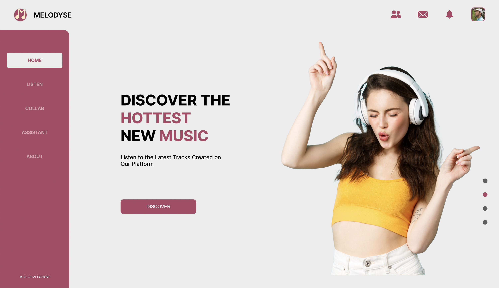 | 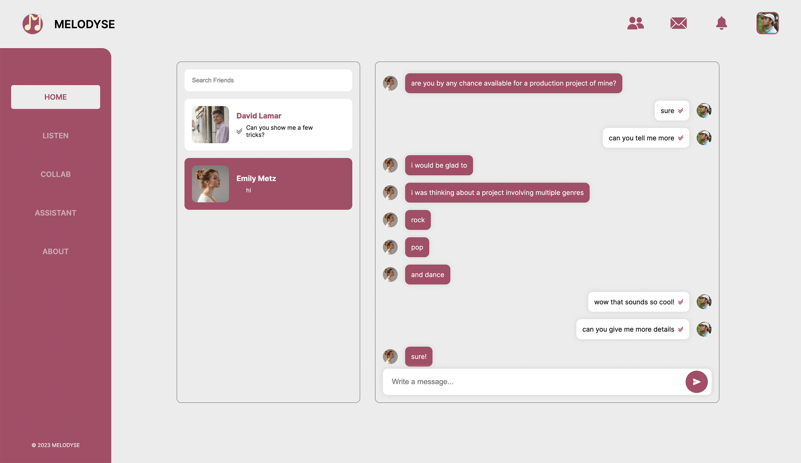 |

| Listen screen | Collab screen  | Profile Screen |
| ---| ---| ---|
| 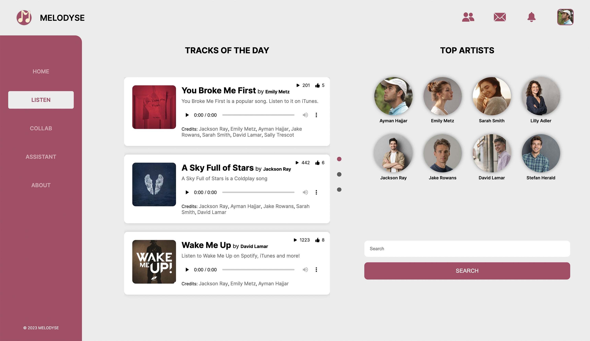 | 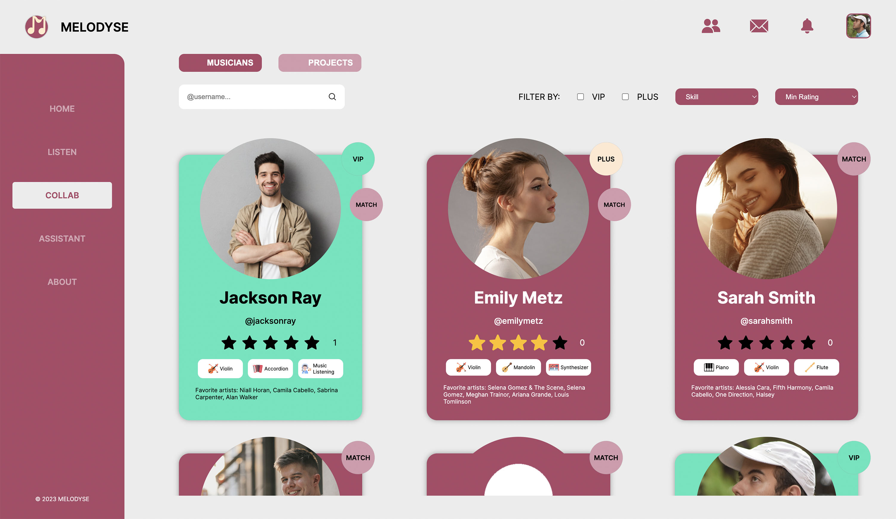 | 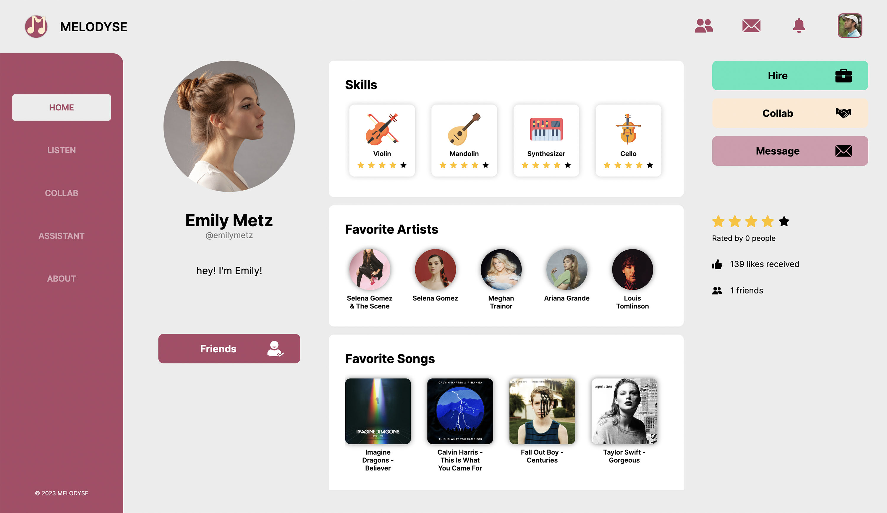 |

| Production Assistant Screen | Songwriting Assistant Screen | Learning Assistant screen  |
| ---| ---| ---|
| 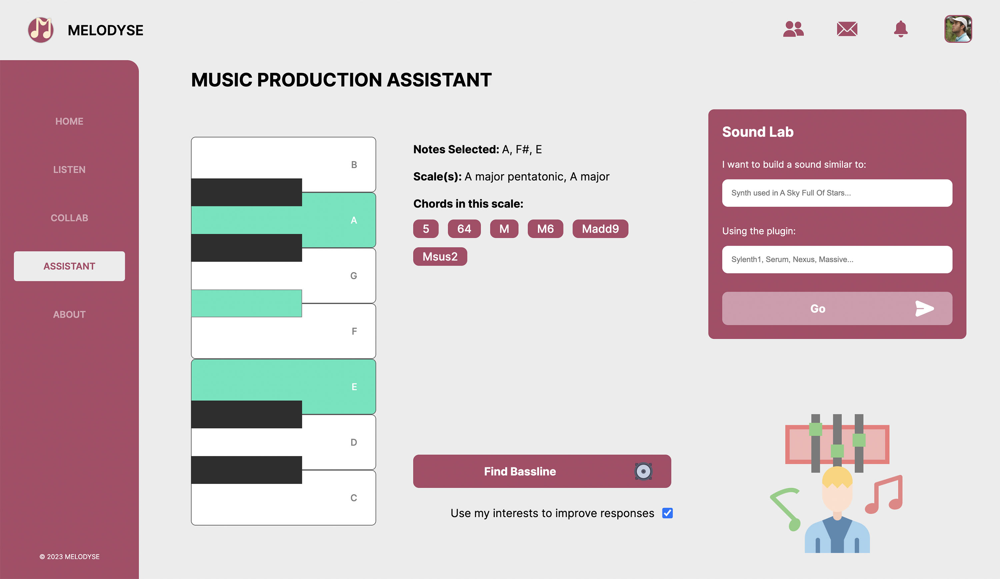 |  | 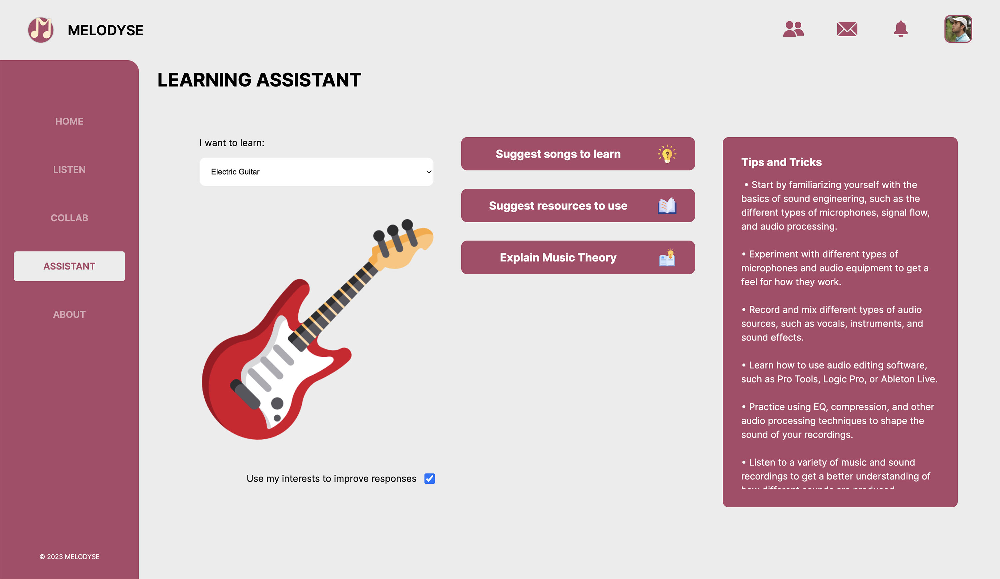 | 

| Release Assistant Screen | Admin Screen | Project Screen |
| ---| ---| ---|
|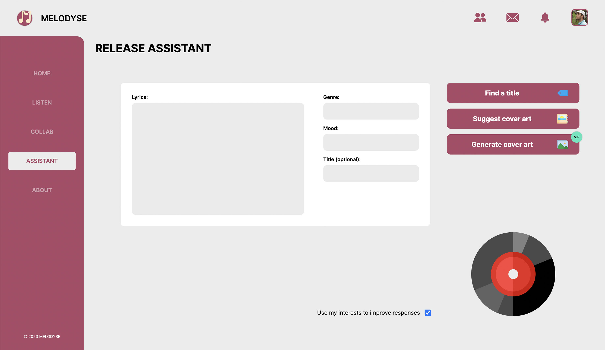 | 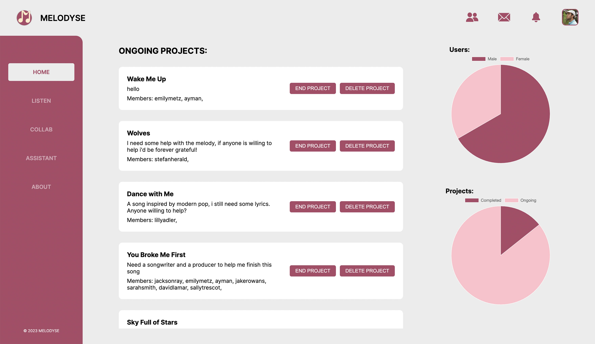|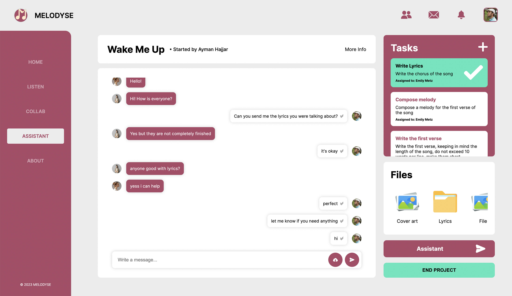 |

### Melodyse in Action
| Home screen  | Sign up screen | Menus |
| ---| ---| ---|
|  | 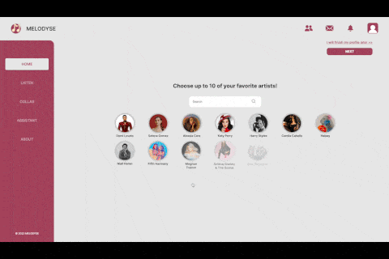 | 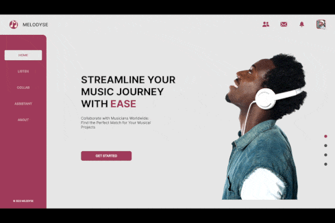 |

| Profile screen | Songwriting Assistant screen  | Release Assistant Screen |
| ---| ---| ---|
| 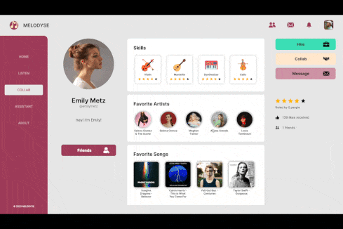 | 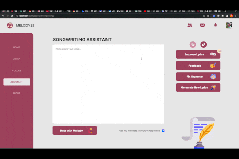 | 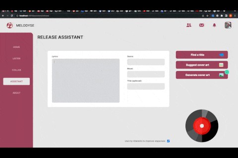 |

| Collab Screen | Project Screen |  |
| ---| ---| ---|
|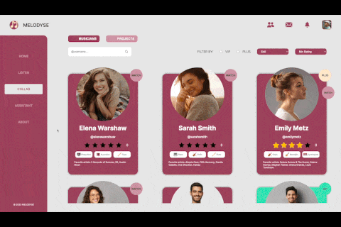 | 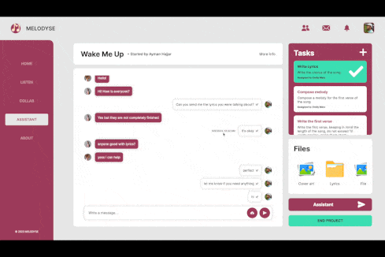| |

> To implement a matching algorithm, we used a small dataset that contains users and their favorite genres. We then used cosine similarity to calculate the similarities between the users. Here is what the dataset looks like :

### Dataset


<br><br>

<!-- Tech stack -->


###  Melodyse is built using the following technologies:

- This project is built using the [Next.js front end framework](https://nextjs.org/). Used by some of the world's largest companies, Next.js enables you to create full-stack Web applications by extending the latest React features, and integrating powerful Rust-based JavaScript tooling for the fastest builds.
- For the back end, we used [Django](https://www.djangoproject.com/). Django is a robust python-based backend framework that makes it easier to build better web apps more quickly and with less code.
- For persistent storage (database), the app uses [PostgreSQL](https://www.postgresql.org/), which allows the app to create a custom storage schema and save it to a local database. Using PostgreSQL instead of other dmbs allows for storage of special data structures like arrays and json objects.
- To allow real-time chatting and real-time notifications, the app uses a combination of [Django Channels](https://channels.readthedocs.io/en/stable/) and [WebSocket](https://developer.mozilla.org/en-US/docs/Web/API/WebSockets_API). 
- The app uses the font ["Inter"](https://fonts.google.com/specimen/Inter) as its main font, and the design of the app adheres to the material design guidelines.

<br><br>

<!-- How to run -->


> To set up Melodyse locally, follow these steps:

### Prerequisites

 * Node.js and npm
To install, visit https://nodejs.org/en/download/ and follow the instructions for your operating system
 * Python 3 and pip
To install, visit https://www.python.org/downloads/ and follow the instructions for your operating system
 * PostgreSQL
To install, visit https://www.postgresql.org/download/ and follow the instructions for your operating system
 * Redis
To install, visit https://redis.io/download and follow the instructions for your operating system

### Installation

1. Sign up on Google Cloud Console, start a new app and get a free CLIENT_ID key [https://console.cloud.google.com/](https://console.cloud.google.com/)
2. Sign up for Spotify for Developers, and get a free CLIENT_ID and CLIENT_SECRET, you can follow the instructions here: [https://developer.spotify.com/documentation/web-api](https://developer.spotify.com/documentation/web-api)
3. Sign up for an OPEN AI developer account, and get a free API key: [https://platform.openai.com/account/api-keys](https://platform.openai.com/account/api-keys)
3. Clone the repo
   ```sh
   git clone https://github.com/aymanhajjar/Melodyse.git
   cd melodyse
   ```
4. Install NPM packages for the frontend
   ```sh
   cd melodyse_frontend
   npm install
   ```
5. Install python packages for the backend
   ```sh
   cd melodyse_backend
   pip install -r requirements.txt
   ```
6. Set up the database
   Create a PostgreSQL database with the name "melodysedb"
7. Create a file inside the folder "melodyse_frontend" called ".env.local", and put the keys you got in the previous steps. The file should be in the following form: 
 ```sh
   GOOGLE_CLIENT_ID=  //your_client_id
   SITE_URL=   //'http://localhost:8000'
   SERVER_SITE_URL=   //'http://127.0.0.1:8000'
   SPOTIFY_CLIENT_ID=   //your_spotify_client_id
   SPOTIFY_CLIENT_SECRET=   //your_spotify_client_secret
   ```
8. Create a file inside the folder "melodyse_backend" called ".env", the file should have the following structure: 
 ```sh
   DB_NAME=  //name_of_the_db_you_created
   DB_USER=   //name_of_the_db_user
   DB_PASSWORD=   //db_password
   DB_HOST=   //localhost
   DB_PORT=   //5432_or_your_custom_port
   OPENAI_API_KEY=   //your_open_ai_key
   SPOTIFY_CLIENT_ID=   //your_spotify_client_id
   SPOTIFY_CLIENT_SECRET=    //your_spotify_client_secret
   GOOGLE_CLIENT_ID=   //your_google_client_id
   ```
9. Run database migrations from the melodyse_backend folder:
   ```sh
   python manage.py migrate
   ```
10. Setup Redis and make sure it is running.

Now, you should be able to run Melodyse locally and explore its features.